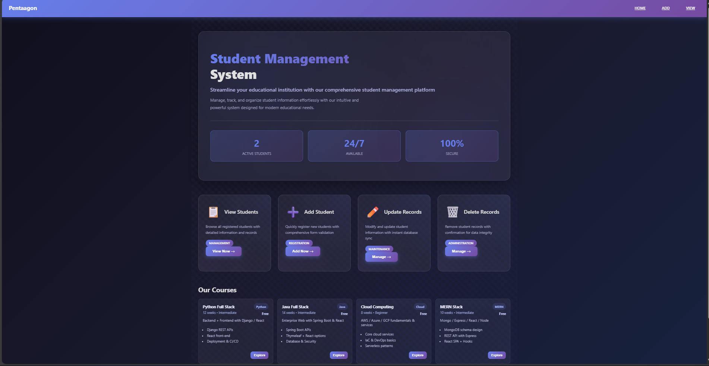
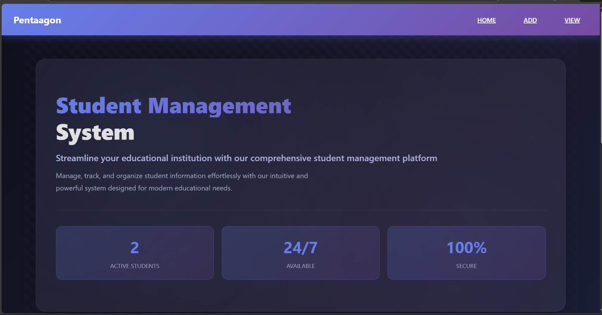
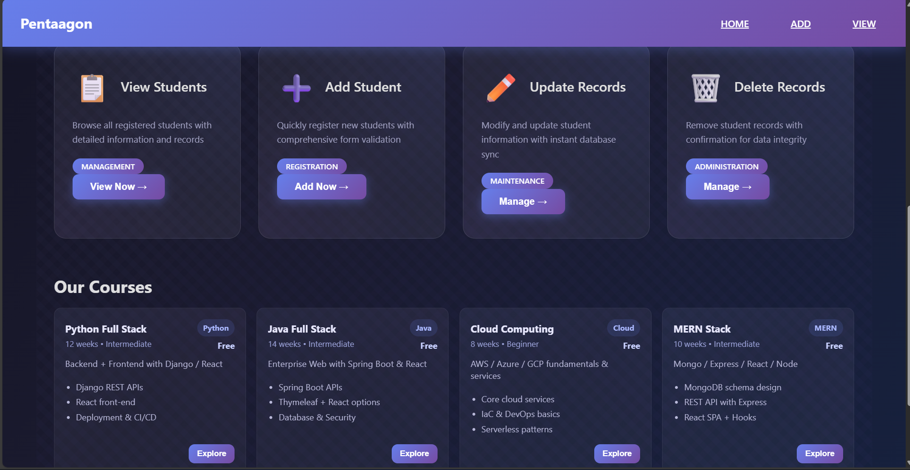
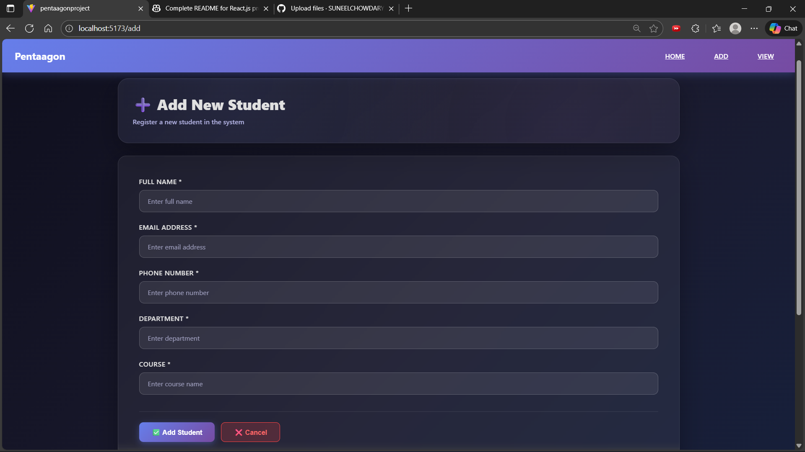

# Student Management System



## Overview

Student Management System is a robust and user-friendly React.js application for managing students, courses, grades, and more. This tool helps educators and administrators organize and access student data efficiently.

## Features

- Add, edit, and delete student records
- Manage courses and enrollments
- Track grades and performance
- Generate reports and statistics
- Simple and intuitive UI

## Screenshots

Sample output from the application:


<br>

<br>


## Prerequisites

- **Node.js** (v16 or later) – [Download](https://nodejs.org/)
- **npm** (comes with Node.js) or **yarn**

## Installation

1. **Clone the repository:**
   ```bash
   git clone https://github.com/SUNEELCHOWDARY/studentmanagement.git
   cd studentmanagement
   ```
2. **Install dependencies:**
   ```bash
   npm install
   ```
3. **Install additional key dependencies:**
   ```bash
   npm i axios react react-dom
   ```
   > These commands install axios (for HTTP requests), react (core framework)

## Usage

### Start the development server
```bash
npm run dev
```
Open [http://localhost:5173](http://localhost:5173) in your browser to view the app.

### Start the backend server (Mock API with json-server)
```bash
npm run backend
```
This runs `json-server` on port 5000 to mock your backend using `db.json`.

## React Project Dependencies

Your project uses the following dependencies (from [`package.json`](https://github.com/SUNEELCHOWDARY/studentmanagement/blob/780b8cd023c2bf61841c9b1ab98661edab34bfc0/package.json)):

```json
"dependencies": {
  "axios": "^1.13.2",
  "json-server": "^1.0.0-beta.3",
  "react": "^19.2.0",
  "react-dom": "^19.2.0",
  "react-router-dom": "^7.9.6",
  "router-dom": "^3.0.3"
},
"devDependencies": {
  "@eslint/js": "^9.39.1",
  "@types/react": "^19.2.5",
  "@types/react-dom": "^19.2.3",
  "@vitejs/plugin-react": "^5.1.1",
  "eslint": "^9.39.1",
  "eslint-plugin-react-hooks": "^7.0.1",
  "eslint-plugin-react-refresh": "^0.4.24",
  "globals": "^16.5.0",
  "vite": "^7.2.4"
}
```

## Output Example

Below is an example of the application's output screens:


## Contributing

Contributions are welcome! Please open an issue or submit a pull request.

## Contact

Created by [SUNEELCHOWDARY](https://github.com/SUNEELCHOWDARY)
